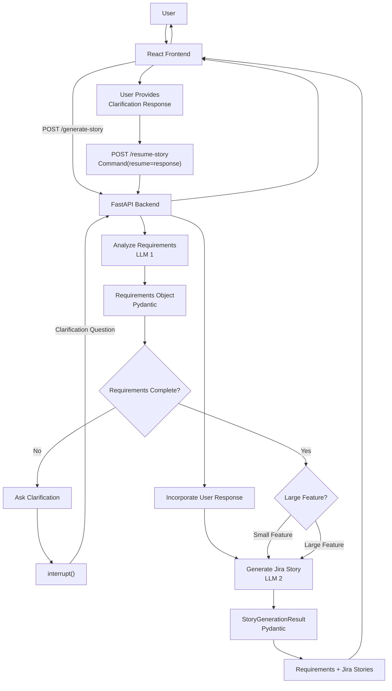

## 🤖 Jira Story Generator
An AI-powered application that converts natural-language feature requirements into structured, implementation-ready Jira user stories.

The application analyzes requirements, detects missing information, asks clarification questions when required, identifies large features, and generates Jira stories with acceptance criteria, functional requirements, technical considerations, subtasks, and story points.

## Features
- Natural-language feature input
- AI-based requirements analysis
- Actor identification
- Feature identification
- Business value extraction
- Technical context extraction
- Implementation area identification
- Missing information detection
- Clarification questions using Human-in-the-Loop
- Small and large feature identification
- Large feature decomposition
- Jira story generation
- Acceptance criteria generation
- Functional requirements generation
- Technical considerations
- Suggested development subtasks
- Story point estimation
- Human review and approval through UI

## Technology stack
- Frontend: React, JavaScript
- Backend: Python, FastAPI
- AI Workflow: LangGraph
- LLM Framework: LangChain
- LLM: Llama 3.2
- Local Model Runtime: Ollama
- Data Validation:Pydantic

## Installation
- Python
- Node.js
- npm
- Ollama
- Git

## Ollama setup
- ollama pull llama3.2:latest

## Backend setup
- cd backend
- python -m venv venv
- venv\Scripts\activate
- pip install -r requirements.txt
- uvicorn app.api:app --reload

## Frontend setup
- cd frontend
- npm install
- npm run dev

## Requirement Analysis
- The first LLM analyzes the natural-language feature and extracts structured requirements such as actor, feature, business value, technical context, implementation areas, feature size, and missing information. If critical information is missing, the workflow pauses and asks the user a clarification question.

## Jira story generation
- Once the requirements are complete, the second LLM generates implementation-ready Jira stories containing the summary, user story, acceptance criteria, functional requirements, technical considerations, suggested subtasks, and story points. The generated output is validated using Pydantic structured models.

## Human-in-the-Loop
- When clarification is required, LangGraph uses 'interrupt()' to pause the workflow. The user provides the missing information through the UI, and the workflow resumes using the same thread ID through '/resume-story'.

## Workflow
1.User Input - User enters a natural-language feature requirement in the React frontend.

2.API Request - React sends the feature idea to the FastAPI backend using POST /generate-story.

3.Requirements Analysis — LLM #1

4.Requirement completeness Check - if information is missing means, workflow generates a clarification question.

5.Human clarification - the user provides the missing information & react sends the response through POST/resume-story.

6.Resume workflow - users clarification response is incorporated into the feature requirements.

7.Feature classification - The system determines whether the feature is a small or large feature.

8.Jira story generation - Generates Jira summary, description, user story, acceptance criteria, functional 
requirements, technical considerations, subtasks, and story points.

9.Structured validation - Pydantic validates the generated StoryGenerationResult.

10.Response - React displays the result for human review and editing.

## Example
Input:
Support agents should be able to search previous customer
orders using an order ID so they can answer customer queries faster.
## Requirement Analysis
Actor:
Support agents

Feature:
Search previous customer orders using an order ID

Business Value:
Answer customer queries faster

Technical Context:
Existing Order API

Implementation Area:
Search functionality

Large Feature:
No

Requirements Complete:
Yes

## Generated Jira Story
Summary

Support agents can search previous customer orders using an order ID

User Story

As a Support agent, I want to search previous customer orders using an order ID, so that I can answer customer queries faster.

Acceptance Criteria

The system returns the customer order associated with the specified order ID.
The system displays an appropriate error message when an invalid order ID is provided.
The system returns an empty result when no order exists for the specified order ID.

Functional Requirements

Implement order search using the order ID.
Use the existing Order API to retrieve order information.

Technical Considerations

Integrate with the existing Order API.

Suggested Subtasks

Implement order search functionality.
Integrate the existing Order API.
Test valid and invalid order ID scenarios.

Story Points

5

## Architecture diagram
